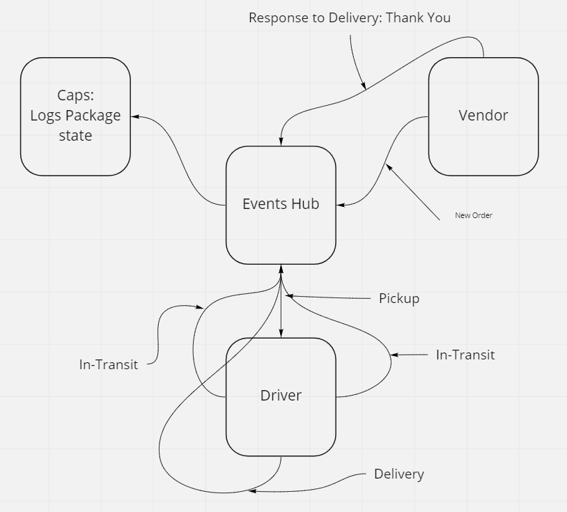

# caps

# Lab 11 ==> Event Driven App

## Deployment Test

Author: Davion Garcia

- [Pull Req 1](https://github.com/Vektur/caps/pull/1)
- Local Testing
- Jest

## Setup
- Node Events

## Running the app

- node caps.js

## Tests

- Event callback functions

## UML

- Whiteboard:

